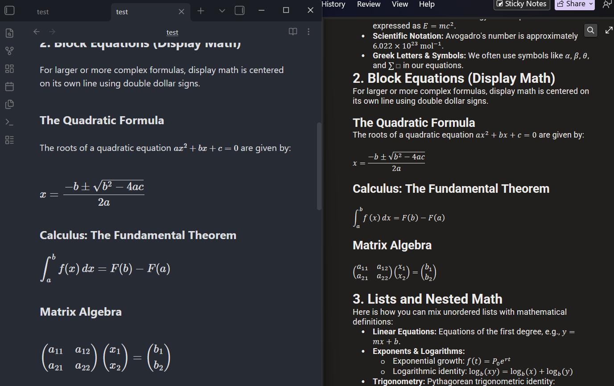

# Copy as HTML with Math (Obsidian Plugin)

An [Obsidian](https://obsidian.md) plugin that copies notes or text selections to your system clipboard as rich HTML, with **mathematical formulas rendered as native MathML or KaTeX representations** for seamless pasting into **Microsoft Word**, **Google Docs**, **Apple Pages**, **LibreOffice**, **Gmail**, and **Anki**.

It also features **smart paste cleanup for ChatGPT & web formulas (`Ctrl + V`)**, eliminating duplicated text and automatically formatting math as clean Obsidian LaTeX.

---

## 🌟 Key Features

### 📐 1. Full Mathematical Formula Copying
Standard copy plugins and Obsidian's default copy leave math formulas inside `$...$` or `$$...$$` as raw LaTeX text. This plugin automatically parses and converts them into:
* **MathML (`<math>`)**: Pastes directly into **Microsoft Word** and converts into native, editable Office Math equations! Also fully supported in **Google Docs**, **Apple Pages**, and **LibreOffice**.
* **HTML + MathML (KaTeX)**: Full visual HTML equation rendering with MathML fallback for web browsers, **Gmail**, **Notion**, **Anki**, and blogs.
* **Direct MathML Copy**: Select any equation and copy directly as pure MathML code.

<!-- SCREENSHOT PLACEHOLDER 1: MATH COPY DEMO -->
<!-- Add screenshot showing markdown with math in Obsidian and the formatted equation in Word/Google Docs -->


---

### 🤖 2. Smart Paste: Auto-Format Math from ChatGPT & Web (`Ctrl + V`)
Copying responses with math from **ChatGPT**, **Claude**, or **Wikipedia** usually causes ugly duplication issues when pasting with `Ctrl + V` into Obsidian (e.g. `pip_i`, `ii`, `nn`, or formulas glued together without `$` signs).

This plugin intercepts `Ctrl + V` and automatically:
* ✅ **Removes duplicate text artifacts** caused by dual KaTeX HTML + MathML layers.
* ✅ **Extracts high-fidelity LaTeX** from the underlying formula annotations.
* ✅ **Wraps formulas in proper Obsidian syntax**: `$...$` for inline math and `$$...$$` for block display equations.
* ✅ **Converts LaTeX brackets**: Translates `\[...\]` and `\(...\)` into standard Obsidian `$$...$$` and `$...$`.

---

### 💻 3. Clean Code Blocks for Notion, Google Docs & Word
* **Unified Boxed Containers**: Code blocks are cleanly formatted as table containers so Notion and Google Docs render them as single, enclosed boxes rather than fragmented lines.
* **Transparent Background by Default**: Code blocks feature a transparent background that naturally adapts to light and dark themes in your destination app.
* **Optional Background Shading**: Toggle on a `#f5f5f5` shaded background if you prefer traditional gray code boxes.

---

### 🎨 4. Rich Media & Formatting Support
* ✅ **Math Formulas** (Inline `$E = mc^2$` and display `$$\sum_{i=1}^n x_i$$`)
* ✅ **Images & Diagrams** (Embedded as Base64 Data URIs so pasted documents don't have broken links)
* ✅ **Mermaid Diagrams & PlantUML**
* ✅ **Excalidraw drawings**
* ✅ **Tables & Callouts** (Optional conversion to HTML tables for enhanced Google Docs pasting)
* ✅ **Code blocks with syntax highlighting**
* ✅ **Obsidian Dataview & Tasks**

<!-- SCREENSHOT PLACEHOLDER 2: SETTINGS TAB -->
<!-- Add screenshot showing the plugin's settings tab, especially the Math formula handling dropdown -->


---

## ⌨️ Commands & Shortcuts

You can trigger these commands from the Command Palette (`Ctrl + P` / `Cmd + P`) or assign custom hotkeys:

| Command | Suggested Hotkey | Description |
|---|---|---|
| **Copy selection or document to clipboard** | `Ctrl + Shift + C` | Copies selection with rendered math; if nothing is selected, copies the whole note. |
| **Copy entire document to clipboard** | — | Copies the entire note as rich HTML with math. |
| **Copy current selection to clipboard** | — | Copies only the selected text with rendered math. |
| **Copy current selection directly as MathML** | — | Copies the selected LaTeX formula directly as pure MathML. |

---

## ⚙️ Settings

Go to **Settings** → **Copy as HTML with Math**:
* **Math formula handling**:
  * `MathML (Recommended)`: Converts to standard MathML. Pastes as native, editable Word equations.
  * `HTML + MathML (KaTeX)`: Full KaTeX rich HTML structure for web and email.
  * `Leave as raw code`: Copies the literal `$ ... $` text.
* **Auto-format pasted math from ChatGPT & Web (Ctrl+V)**: Automatically cleans duplicate math text and formats formulas from ChatGPT, Claude, and Wikipedia into clean Obsidian LaTeX (enabled by default).
* **Render code with tables**: Formats code blocks as tables so they paste as unified boxed containers in Notion and Google Docs.
* **Code block background color**: Toggles between transparent background (default) and shaded `#f5f5f5` background.
* **Include filename as header**: Automatically inserts the document title as an `<h1>` header when copying the full document.
* **Convert SVG to bitmap**: Converts SVG diagrams to PNG bitmaps for compatibility with Gmail.
* **Embed external images**: Downloads and embeds remote images directly into clipboard HTML.
* **Copy HTML fragment only**: Excludes `<head>` and `<html>` wrapper when only snippet pasting is needed.
* **Custom Stylesheet & Template**: Provide custom CSS to control table borders, fonts, and colors.

---

## 📥 Installation

### Method 1: Obsidian Community Plugins (Coming Soon)
Search for **Copy as HTML with Math** in Obsidian's in-app Community Plugins browser (**Settings** → **Community Plugins** → **Browse**).

### Method 2: Via BRAT (Beta Reviewer's Auto-update Tester)
1. Install the **BRAT** community plugin in Obsidian.
2. In BRAT settings, click **Add Beta Plugin**.
3. Enter repository URL: `https://github.com/NANI-31/obsidian-copy-html-with-math`
4. BRAT will automatically download the plugin and keep it up to date!

### Method 3: Manual Installation
1. Download `main.js`, `manifest.json`, and `styles.css` from the [Latest Release](https://github.com/NANI-31/obsidian-copy-html-with-math/releases).
2. Create a folder in your vault: `<Vault>/.obsidian/plugins/copy-html-with-math/`.
3. Copy the 3 files into that folder.
4. In Obsidian, go to **Settings** → **Community Plugins**, reload, and enable **Copy as HTML with Math**.

---

## 🛠️ Development & Building

```bash
# Clone the repository
git clone https://github.com/NANI-31/obsidian-copy-html-with-math.git
cd obsidian-copy-html-with-math

# Install dependencies
npm install

# Build production bundle
npm run build

# Start live dev watcher
npm run dev
```

---

## 📜 Credits & License

* Developed and maintained by **NANI-31**.
* Based on the original [obsidian-copy-as-html](https://github.com/mvdkwast/obsidian-copy-as-html) by **mvdkwast**.
* Mathematical typesetting powered by [KaTeX](https://katex.org/).
* Licensed under the [MIT License](LICENSE).
